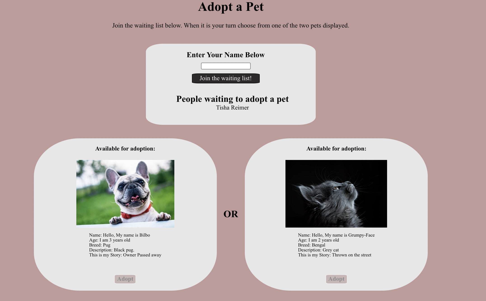

# Petful Client

This project was bootstrapped with [Create React App](https://github.com/facebook/create-react-app).

Live application: [https://petful-client-lyart.vercel.app/](https://petful-client-lyart.vercel.app/)

API Repo: [https://github.com/Nishat322/Petful-api](https://github.com/Nishat322/Petful-api)

## User Story

Petful allows users to adopt a dog or a cat. Users queue up to adopt a pet and as the queue progress, the user is pushed further to the front of the line. While the user is in the line they may see which pets are up for adoption but may not adopt a pet. When a user is in the front of the line they can choose to adopt either a dog or a cat. Once they choose a pet they are removed from the queue. Users are welcome to queue up again.

### HomePage

### Adoption Page

## Tech Stack

### Frontend
- ReactJS
- React Router
- CSS
- HTML
- Webpack
- Vercel

### Backend
- RESTful API
- Node
- Express
- Heroku

